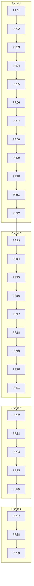

# Backlog executável — AgendAI → SaaS multi-tenant

Referência: [`plano-migracao-saas.txt`](./plano-migracao-saas.txt)  
Premissa técnica: PostgreSQL compartilhado + `TenantId` + global query filters + `tenant_id` no JWT.

**Convenções**
- Cada **PR** deve ser revisável em **&lt; 30 min** (meta: diff &lt; ~400 linhas).
- **Depende de**: PRs que precisam estar em `main` antes.
- **CA** = critérios de aceite.
- Estimativa: **P** ≤½ dia, **M** ~1 dia, **G** evitar (PRs G foram fatiados abaixo).

---

## Visão da ordem de PRs (29 PRs até MVP)

| Ordem | PR | Sprint | Tema |
|------:|-----|--------|------|
| 1 | PR-01 | 1 | Postgres prod + secrets |
| 2 | PR-02 | 1 | Projeto de testes de integração (scaffold) |
| 3 | PR-03 | 1 | Teste: login baseline |
| 4 | PR-04 | 1 | Teste: paciente CRUD + skip cross-tenant |
| 5 | PR-05 | 1 | Entidade `Tenant` + `ITenantOwned` + `DbSet` |
| 6 | PR-06 | 1 | `TenantId` nas 11 entidades (só C#) |
| 7 | PR-07 | 1 | Migration: tabela `Tenants` + seed default |
| 8 | PR-08 | 1 | Migration: colunas `TenantId` nullable + FKs |
| 9 | PR-09 | 1 | Migration: backfill + `NOT NULL` |
| 10 | PR-10 | 1 | Migration: índices únicos compostos |
| 11 | PR-11 | 1 | Singletons clínica/painel + seed |
| 12 | PR-12 | 1 | Doc deploy da migration (`migration-saas.md`) |
| 13 | PR-13 | 2 | `ITenantContext` + DI |
| 14 | PR-14 | 2 | Global query filters |
| 15 | PR-15 | 2 | Interceptor `SaveChanges` |
| 16 | PR-16 | 2 | `PacienteService` + `UsuarioService` |
| 17 | PR-17 | 2 | `ProcedimentoService` + `AuthService` (prep) |
| 18 | PR-18 | 2 | `AgendaService` + `AgendamentoService` |
| 19 | PR-19 | 2 | `AtendimentoService` + `FinanceiroService` |
| 20 | PR-20 | 2 | `PainelTvService` |
| 21 | PR-21 | 2 | Testes cross-tenant |
| 22 | PR-22 | 3 | DTOs login + validação `AuthController` |
| 23 | PR-23 | 3 | `AuthService.LoginAsync` por `tenantSlug` |
| 24 | PR-24 | 3 | JWT `tenant_id` + `HttpTenantContext` |
| 25 | PR-25 | 3 | Recuperação de senha por tenant |
| 26 | PR-26 | 3 | Painel TV por `tenantSlug` |
| 27 | PR-27 | 4 | DTOs + contrato `ITenantProvisioningService` |
| 28 | PR-28 | 4 | `TenantProvisioningService` |
| 29 | PR-29 | 4 | `POST /tenants/register` + docs |
| 30+ | PR-30… | 5+ | Billing / enterprise |

### O que foi fatiado (PRs antigos → novos)

| Antigo | Novo |
|--------|------|
| PR-02 (M/G) | PR-02, PR-03, PR-04 |
| PR-03 (M) | PR-05, PR-06 |
| PR-04 (G) | PR-07, PR-08, PR-09, PR-10, PR-12 |
| PR-05 (M) | PR-11 |
| PR-07 (G) | PR-14, PR-15 |
| PR-08 (M) | PR-16, PR-17 |
| PR-09 (M) | PR-18, PR-19, PR-20 |
| PR-10 | PR-21 |
| PR-11 (M) | PR-22, PR-23, PR-24 |
| PR-13 (M) | PR-26 |
| PR-14 (M) | PR-27, PR-28 |
| PR-15 | PR-29 |

---

## Sprint 1 — Fundação e modelo

**Objetivo:** Postgres em prod; schema multi-tenant; dados legados no tenant `default`.

---

### PR-01 — Postgres em produção e segredos fora do repo

| **Depende de** | — | **Tamanho** | P |

**Arquivos:** `render.yaml`, `appsettings.json`, `appsettings.Production.json`, `docs/deploy.md` (criar)

**CA**
- [ ] `Data__UseInMemory` ≠ `true` em Production.
- [ ] Sem credenciais de banco no repo.
- [ ] Deploy Render persiste dados após restart.
- [ ] `docs/deploy.md` lista variáveis obrigatórias.

---

### PR-02 — Scaffold `AgendAI.Integration.Tests`

| **Depende de** | PR-01 | **Tamanho** | P |

**Arquivos**
| Arquivo | Ação |
|---------|------|
| `AgendAI.Integration.Tests/AgendAI.Integration.Tests.csproj` | Novo projeto; referência à API |
| `AgendAI.Integration.Tests/AgendAiWebApplicationFactory.cs` | Factory + DB in-memory ou Testcontainers (documentar escolha) |
| `AgendAI.API/Program.cs` | `public partial class Program { }` se necessário |
| `.github/workflows` ou script CI | `dotnet test` inclui integration |

**CA**
- [ ] `dotnet test` executa o projeto (mesmo com 0 testes de negócio ainda).
- [ ] README: como rodar testes localmente.

---

### PR-03 — Teste baseline: login

| **Depende de** | PR-02 | **Tamanho** | P |

**Arquivos:** `AgendAI.Integration.Tests/Auth/LoginTests.cs`

**CA**
- [ ] Login com usuário do seed → 200 + `accessToken` (ou campo equivalente).
- [ ] Credenciais inválidas → 401.

---

### PR-04 — Teste baseline: paciente + placeholder cross-tenant

| **Depende de** | PR-03 | **Tamanho** | P |

**Arquivos:** `AgendAI.Integration.Tests/Pacientes/PacienteCrudTests.cs`, `.../CrossTenantTests.cs`

**CA**
- [ ] Autenticado: criar paciente → GET lista contém o id.
- [ ] `CrossTenant_PacienteNaoVisivelEntreTenants` existe com `[Skip("PR-21")]`.

---

### PR-05 — Entidade `Tenant` + `ITenantOwned` + EF config

| **Depende de** | PR-04 | **Tamanho** | P |

**Arquivos**
| Arquivo | Ação |
|---------|------|
| `Domain/Entities/Tenant.cs` | Criar |
| `Domain/Abstractions/ITenantOwned.cs` | `Guid TenantId { get; set; }` |
| `Infra/.../TenantConfiguration.cs` | Índice único `Slug` |
| `AgendAiDbContext.cs` | `DbSet<Tenant> Tenants` |

**CA**
- [ ] Compila; **sem migration** neste PR.
- [ ] `Tenant` não implementa `ITenantOwned`.

---

### PR-06 — `TenantId` nas entidades de negócio (somente modelo C#)

| **Depende de** | PR-05 | **Tamanho** | M |

**Entidades:** `Usuario`, `Paciente`, `PacienteAnamnese`, `PacienteHistorico`, `Procedimento`, `Agendamento`, `BloqueioAgenda`, `Atendimento`, `Lancamento`, `TokenRecuperacaoSenha`, `ConfiguracaoClinica`, `ChamadaPainelTvAtual` → implementar `ITenantOwned`.

**CA**
- [ ] Compila; ainda **sem migration**.
- [ ] `Entity.cs` permanece só com `Id` (sem `TenantId` na base).

---

### PR-07 — Migration: criar `Tenants` + tenant default

| **Depende de** | PR-06 | **Tamanho** | P |

**Arquivos:** `Migrations/*AddTenantsTable*.cs`

**SQL conceitual**
- `CREATE TABLE Tenants`
- `INSERT` tenant default: `00000000-0000-0000-0000-000000000001`, slug `default`

**CA**
- [ ] `dotnet ef database update` em banco vazio cria só `Tenants` + 1 linha.
- [ ] App antiga ainda pode rodar se não depender de colunas novas (ou merge imediato do próximo PR).

---

### PR-08 — Migration: `TenantId` nullable + FKs (sem trocar índices únicos ainda)

| **Depende de** | PR-07 | **Tamanho** | M |

**Arquivos:** todas `*Configuration.cs` de entidades tenant-owned — adicionar `TenantId` opcional + `HasOne<Tenant>()`.

**CA**
- [ ] Colunas `TenantId` nullable em todas as tabelas de negócio.
- [ ] FK para `Tenants` criada.
- [ ] Índices únicos **globais antigos** ainda presentes (quebrar só no PR-10).

---

### PR-09 — Migration: backfill + `NOT NULL`

| **Depende de** | PR-08 | **Tamanho** | P |

**SQL conceitual**
- `UPDATE` todas as linhas → `TenantId = default`
- `ALTER COLUMN TenantId SET NOT NULL`

**CA**
- [ ] Nenhuma linha com `TenantId` NULL após migration.
- [ ] Dados legados acessíveis como tenant `default` (validar com query manual ou teste após PR-11).

---

### PR-10 — Migration: índices únicos compostos

| **Depende de** | PR-09 | **Tamanho** | M |

**Arquivos**
| Configuration | Mudança |
|---------------|---------|
| `UsuarioConfiguration.cs` | `(TenantId, Login)`, `(TenantId, Email)` |
| `PacienteConfiguration.cs` | `(TenantId, Cpf)` |
| `AgendamentoConfiguration.cs` | `TenantId` nos índices de conflito |
| `AtendimentoConfiguration.cs` | Idem |

**CA**
- [ ] Índices globais antigos removidos.
- [ ] Dois logins iguais em tenants diferentes: permitido.
- [ ] Dois logins iguais no mesmo tenant: bloqueado.

---

### PR-11 — Remover singletons + seed `TenantDefault`

| **Depende de** | PR-10 | **Tamanho** | M |

**Arquivos:** `ConfiguracaoClinicaConfiguration.cs`, `ChamadaPainelTvAtualConfiguration.cs`, `PainelTvService.cs`, `SeedIds.cs`, `AgendAiDbSeeder.cs`

**CA**
- [ ] Sem `HasData(Id=1)`.
- [ ] Índice único `TenantId` em config e painel.
- [ ] Seed usa `SeedIds.TenantDefault`.
- [ ] PR-03 e PR-04 passam.

---

### PR-12 — Documentação operacional da migration

| **Depende de** | PR-11 | **Tamanho** | P |

**Arquivos:** `docs/migration-saas.md`

**CA**
- [ ] Passo a passo: backup, `dotnet ef database update`, janela de downtime.
- [ ] Rollback / contingência descritos.
- [ ] Ordem PR-07 → PR-10 referenciada.

---

## Sprint 2 — Isolamento automático

---

### PR-13 — `ITenantContext` + implementações + DI

| **Depende de** | PR-12 | **Tamanho** | P |

**Arquivos:** `ITenantContext.cs`, `HttpTenantContext.cs`, `NullTenantContext.cs`, `ProvisioningTenantContext.cs`, `DependencyInjection.cs`, stub `GetTenantId()` em `ClaimsPrincipalExtensions.cs`

**CA**
- [ ] `HealthController` OK sem tenant.
- [ ] Request HTTP resolve `ITenantContext` sem exceção.

---

### PR-14 — Global query filters

| **Depende de** | PR-13 | **Tamanho** | M |

**Arquivos:** `AgendAiDbContext.cs` — `HasQueryFilter` para cada `ITenantOwned` via reflexão ou registro explícito.

**CA**
- [ ] Com `ProvisioningTenantContext` ou factory de teste setando tenant A, `db.Pacientes` não retorna de B.
- [ ] **Sem** interceptor ainda (PR-15).

---

### PR-15 — Interceptor `TenantSaveChangesInterceptor`

| **Depende de** | PR-14 | **Tamanho** | P |

**Arquivos:** `Persistence/Interceptors/TenantSaveChangesInterceptor.cs`, `DependencyInjection.cs`

**CA**
- [ ] Insert sem `TenantId` → preenche do contexto.
- [ ] Insert/Update com `TenantId` divergente → exceção.
- [ ] Design-time / migrations documentados (`NullTenantContext` ou factory).

---

### PR-16 — `PacienteService` + `UsuarioService`

| **Depende de** | PR-15 | **Tamanho** | M |

**CA**
- [ ] CPF duplicado só no tenant.
- [ ] Sem `IgnoreQueryFilters()`.
- [ ] Testes PR-03/04 passam.

---

### PR-17 — `ProcedimentoService` + `AuthService` (prep, sem slug ainda)

| **Depende de** | PR-16 | **Tamanho** | M |

**Arquivos:** `ProcedimentoService.cs`, `AuthService.cs` — buscas por login filtram `TenantId` do contexto (dev: tenant default fixo até PR-23).

**CA**
- [ ] Nenhuma query global de login/email.
- [ ] Login ainda funciona com tenant default no contexto de teste.

---

### PR-18 — `AgendaService` + `AgendamentoService`

| **Depende de** | PR-17 | **Tamanho** | M |

**CA**
- [ ] Conflitos de horário escopados ao tenant.
- [ ] `ConfiguracoesClinica` respeita filtro global.

---

### PR-19 — `AtendimentoService` + `FinanceiroService`

| **Depende de** | PR-18 | **Tamanho** | M |

**CA**
- [ ] FKs e lançamentos não cruzam tenants.

---

### PR-20 — `PainelTvService`

| **Depende de** | PR-19 | **Tamanho** | P |

**CA**
- [ ] Sem `RegistroUnicoId`; usa contexto/filtro.

---

### PR-21 — Testes cross-tenant

| **Depende de** | PR-20 | **Tamanho** | M |

**Cenários:** paciente isolado; GET id de outro tenant → 404/403; agenda com 2 tenants; remover `[Skip]` do PR-04.

**CA**
- [ ] Todos os testes `CrossTenant_*` verdes.
- [ ] MVP critério 1 atendido.

---

## Sprint 3 — Auth e superfícies públicas

---

### PR-22 — DTOs e contrato de login multi-tenant (API)

| **Depende de** | PR-21 | **Tamanho** | P |

**Arquivos:** `LoginRequest.cs` (`TenantSlug`), `LoginResponse.cs` (`TenantId`, `TenantSlug`, `TenantNome`), `AuthController.cs` — validação 400 se slug vazio.

**CA**
- [ ] OpenAPI atualizado.
- [ ] **Ainda não** altera comportamento de login (ou feature flag) até PR-23 — documentar no PR.

---

### PR-23 — `AuthService.LoginAsync` por `tenantSlug`

| **Depende de** | PR-22 | **Tamanho** | M |

**Arquivos:** `AuthService.cs` — resolver tenant ativo; `Where(TenantId && Login)`; tenant inativo → 403.

**CA**
- [ ] Login exige slug válido.
- [ ] Credenciais de outro tenant → falha.

---

### PR-24 — JWT `tenant_id` + `HttpTenantContext`

| **Depende de** | PR-23 | **Tamanho** | P |

**Arquivos:** `JwtTokenGenerator.cs`, `HttpTenantContext.cs`, `ClaimsPrincipalExtensions.cs`

**CA**
- [ ] JWT contém `tenant_id`.
- [ ] Rotas autenticadas usam tenant do token.
- [ ] MVP critério 2 atendido.

---

### PR-25 — Recuperação de senha com tenant

| **Depende de** | PR-24 | **Tamanho** | M |

**Arquivos:** `ForgotPasswordRequest.cs`, `ResetPasswordRequest.cs`, `AuthService.cs`

**CA**
- [ ] `TenantSlug` na tela de esqueci senha (breaking change documentado).
- [ ] Token não cruza tenants.

---

### PR-26 — Painel TV por `tenantSlug`

| **Depende de** | PR-24 | **Tamanho** | M |

**Arquivos:** `PainelTvController.cs`, `IPainelTvService.cs`, `PainelTvService.cs`, `docs/frontend-painel-tv.md`

**CA**
- [ ] Rotas `.../painel-tv/{tenantSlug}/...`.
- [ ] Tenant A não vê dados de B.
- [ ] MVP critério 5 atendido.

---

## Sprint 4 — Onboarding

---

### PR-27 — DTOs + `ITenantProvisioningService`

| **Depende de** | PR-26 | **Tamanho** | P |

**Arquivos:** `RegisterTenantRequest.cs`, `RegisterTenantResponse.cs`, `ITenantProvisioningService.cs`

**CA**
- [ ] Contratos compilam; sem implementação ainda.

---

### PR-28 — `TenantProvisioningService`

| **Depende de** | PR-27 | **Tamanho** | M |

**Arquivos:** `TenantProvisioningService.cs`, uso de `ProvisioningTenantContext`, `DependencyInjection.cs`

**Fluxo transacional:** Tenant → Config → Painel → Admin → (opcional) procedimentos.

**CA**
- [ ] Slug duplicado → 409; falha → rollback.
- [ ] Teste de integração chama serviço diretamente (sem controller).

---

### PR-29 — `POST /tenants/register` + docs

| **Depende de** | PR-28 | **Tamanho** | P |

**Arquivos:** `TenantsController.cs`, `README.md`, `docs/onboarding-cliente.md`

**CA**
- [ ] Uma chamada HTTP cria clínica completa.
- [ ] MVP critério 3 atendido.

---

## Sprint 5+ — Comercial e enterprise

| PR | Tema | Sugestão de fatiamento |
|----|------|------------------------|
| PR-30 | Entidades `Plano`, `Assinatura` + migration | só schema |
| PR-31 | Serviço assinatura + status no `Tenant` | sem gateway |
| PR-32 | Webhook Stripe/Pagar.me | 1 PR por provedor |
| PR-33 | Limites por plano em `UsuarioService` | — |
| PR-34 | `AuditLog` + interceptor | schema + write |
| PR-35 | Export LGPD paciente | endpoint único |
| PR-36 | Serilog `TenantId` + rate limit register/login | 2 PRs |

---

## Coordenação frontend

| PR API | Frontend |
|--------|----------|
| PR-24 | Campo clínica no login |
| PR-25 | Esqueci senha + slug |
| PR-26 | URL painel TV |
| PR-29 | Cadastro de clínica |

---

## Trello — listas sugeridas

| Lista | PRs |
|-------|-----|
| Sprint 1 | PR-01 … PR-12 |
| Sprint 2 | PR-13 … PR-21 |
| Sprint 3 | PR-22 … PR-26 |
| Sprint 4 | PR-27 … PR-29 |
| Pós-MVP | PR-30 … |
| Done | — |

**1 card = 1 PR.** Título: `PR-07 Migration Tenants table`. Descrição: copiar **CA** + arquivos.

---

## Definition of Done (todo PR)

- [ ] Diff focado; ideal &lt; 400 linhas.
- [ ] `dotnet test` verde.
- [ ] Migration testada localmente (se aplicável).
- [ ] Breaking changes no corpo do PR.
- [ ] CA do card marcados.

---

*Atualizado: PRs grandes fatiados (29 PRs até MVP).*
